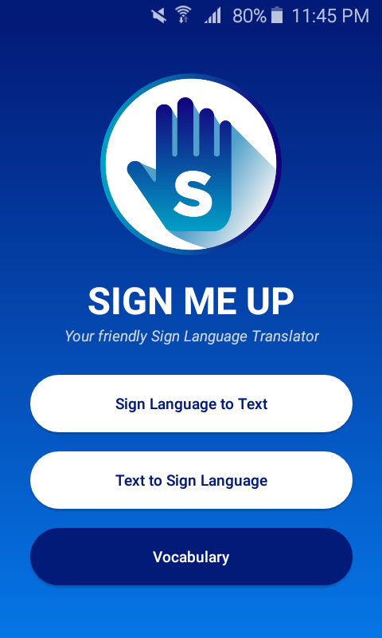

# Sign Me Up

An Android Sign Language Translator Using Convolutional Neural Networks

___

SP output for CMSC 190 (ICS-UPLB) by *Carlos Miguel E. Canonizado* **(Advisee)** and *Jaime M. Samaniego* **(Adviser)**

___

### Content:

* **/android** for the Android Studio files
* **/cnn** for the Python CNN files
* **/journal** for the LaTeX files